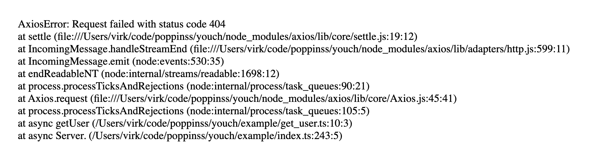
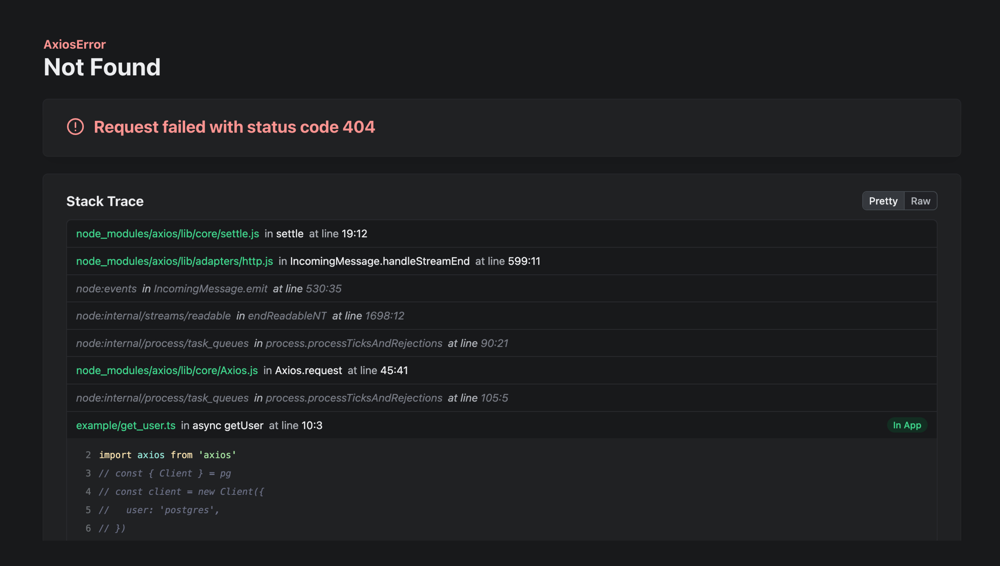

# Youch

> Pretty print JavaScript errors on the Web and the Terminal

<br />

[![gh-workflow-image]][gh-workflow-url] [![npm-image]][npm-url] ![][typescript-image] [![license-image]][license-url]


## What is Youch?

Youch is an error parsing library that pretty prints JavaScript errors on a web-page or the terminal.

As you can see in the following screenshots, the Youch output deconstructs the error and properly displays the error message, name, stack trace with source code and a lot more information about the error.

<table>
  <tbody>
    <tr>
      <td>
        <strong>Raw stack trace</strong>
      </td>
    </tr>
    <tr>
      <td>
        
      </td>
    </tr>
    <tr>
      <td>
        <strong>Youch Output</strong>
      </td>
    </tr>
    <tr>
      <td>
        
      </td>
    </tr>
  </tbody>
<table>

## Basic usage

Install the package from the npm packages registry as follows.

```sh
npm i youch

# Yarn
yarn add youch

# Pnpm
pnpm add youch
```

Once installed. You can render errors to HTML output using the `youch.render` method. The HTML output is self-contained and does not require separate CSS or JavaScript files.

In the following example, we use the `hono` framework and pretty print all the errors in development using Youch. You can replace Hono with any other framework of your choice.

```ts
import { Youch } from 'youch'
const IN_DEV = process.env.NODE_ENV === 'development'

app.onError((err, c) => {
  if (IN_DEV) {
    const youch = new Youch({ title: 'Something went wrong' })
    const html = await youch.render(err)
    return html
  }
})
```

## Anatomy of the error page

Let's de-construct the error page and understand what each section of the web page represents.

### Error info


The top-most section displays the Error info, which includes:

- The Error class constructor name
- The Error title set using the `options.title` property.
- And the Error message (highlighted in red).

See: [How to override the Error info template]()

### Stack trace

The Stack trace section displays individual frames as accordion sections and clicking on the section title will reveal the frame source code. The soure code is not available for native stack frames that are part of the Node.js, Deno, and Bun internals.


Clicking the `Raw` button displays the Error object in its raw form with all the error properties (and not just the stack trace).

You might find the raw output helpful for errors that contains additional properties. For example: HTTP client libraries like Axios, Got, Undici and others usually contain the HTTP response details within the error object.


### Error cause

[Error cause](https://developer.mozilla.org/en-US/docs/Web/JavaScript/Reference/Global_Objects/Error/cause) is a standard way to bubble errors while wrapping them within a generic error. Youch displays the error cause as an interactive property within its own section.


### Metadata

Metadata refers to any additional data that you want to display on the error page. It could be the HTTP request headers, the logged-in user info, or the list of available application routes.

Metadata is structured as groups and sections. Each section contains an array of rows and each row is composed of a `key-value` pair.

In the following example, we display the request headers under the `Request` group and the `Headers` section.

```ts
const youch = new Youch()

youch.group('Request', {
  headers: [
    {
      key: 'cookie',
      value: req.headers.cookie,
    },
    {
      key: 'host',
      value: req.headers.host,
    },
  ],
})
```

Calling the `youch.group` method multiple times with the same group name will merge the new sections with existing sections.

## Using a custom source code loader

The Error info is displayed using the [ErrorInfo](https://github.com/poppinss/youch/blob/4.x/src/templates/error-info/main.ts) component and you can override it with a custom component as follows.

```ts
import { BaseComponent } from 'youch/component'
import { ErrorInfoProps } from 'youch/types'

class MyErrorInfo extends BaseComponent<ErrorInfoProps> {
  render() {}
}

const youch = new Youch({ title: 'Something went wrong' })
youch.use('errorInfo', new MyErrorInfo())
```

## Injecting custom styles

## Attaching metadata

## Overriding syntax highlighter

## Overriding templates

## Pre-parsing errors

## Transforming parser error

## Contributing

One of the primary goals of Poppinss is to have a vibrant community of users and contributors who believes in the principles of the framework.

We encourage you to read the [contribution guide](https://github.com/poppinss/.github/blob/main/docs/CONTRIBUTING.md) before contributing to the framework.

## Code of Conduct

In order to ensure that the Poppinss community is welcoming to all, please review and abide by the [Code of Conduct](https://github.com/poppinss/.github/blob/main/docs/CODE_OF_CONDUCT.md).

## License

Youch is open-sourced software licensed under the [MIT license](LICENSE.md).

[gh-workflow-image]: https://img.shields.io/github/actions/workflow/status/poppinss/youch/checks.yml?style=for-the-badge
[gh-workflow-url]: https://github.com/poppinss/youch/actions/workflows/checks.yml 'Github action'
[typescript-image]: https://img.shields.io/badge/Typescript-294E80.svg?style=for-the-badge&logo=typescript
[typescript-url]: "typescript"
[npm-image]: https://img.shields.io/npm/v/youch.svg?style=for-the-badge&logo=npm
[npm-url]: https://npmjs.org/package/youch 'npm'
[license-image]: https://img.shields.io/npm/l/youch?color=blueviolet&style=for-the-badge
[license-url]: LICENSE.md 'license'
